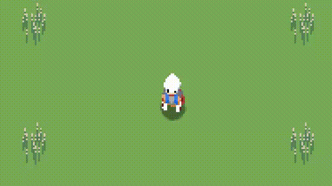

# Sprite Stacking Engine

## Made using lua and the love2D game engine

A basic sprite-stacking engine that makes a collection of 2D sprites look 3D. This prototype only has the basics of rendering models with the option for movement.

## Gif
